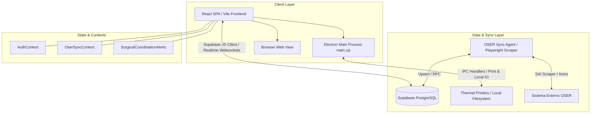

# Arquitectura General del Sistema - Panel de Cirugías 1.0

> [!NOTE]
> Documentación generada bajo la metodología **CodeWiki** para el sistema **Coordinación Quirófano / Panel de Cirugías 1.0**.

---

## 🏗️ Visión General de Arquitectura

El **Panel de Cirugías 1.0** es una aplicación médica de gestión hospitalaria y coordinación de quirófanos construida sobre un modelo **Híbrido Web / Desktop (Electron + React)** con sincronización en tiempo real vía **Supabase**.

---

## 🧩 Capas del Sistema

### 1. Capa de Presentación (Frontend SPA)
- **Framework**: React 18 con TypeScript y Vite.
- **Estilos**: TailwindCSS con tematización médica personalizada (Glassmorphism, Modo Oscuro/Claro).
- **Rutas e Interfaz**: Navegación dinámica por vistas (`pages/`), navegación lateral fija (`Sidebar.tsx`) y barra superior con notificaciones y estado de sincronización.

### 2. Capa Desktop (Electron Main & Preload)
- **Main Process (`main.cjs`)**:
  - Gestión de ventanas (`BrowserWindow`).
  - Auto-actualizaciones en segundo plano.
  - Controlador de impresión térmica de pulseras de paciente (280mm x 30mm) y partes quirúrgicos (PDF / Ficha).
  - Integración IPC para canal silencioso de impresión en impresoras ZD420/Zebra/TSC.
- **Preload Script (`preload.cjs`)**:
  - Exposición segura de APIs nativas a la ventana de React vía `window.electronAPI`.

### 3. Capa de Datos y Persistencia (Supabase Backend)
- **Base de Datos**: PostgreSQL alojado en Supabase con Row Level Security (RLS) basado en roles.
- **Tiempo Real**: Suscripciones Supabase Realtime (`postgres_changes`) en `quirofano.cirugias` para actualización instantánea en Kanban, Calendario y Monitores.
- **Autenticación**: Supabase Auth con tokens JWT y tabla extendida de perfiles/roles (`public.profiles`).

### 4. Capa de Sincronización Externa (OSER / SAI Sync)
- **Scraper Playwright (`sai-scraper/`)**: Módulo headless para la extracción de partes quirúrgicos del sistema legacy SAI/OSER.
- **Proceso en Segundo Plano (`OserSyncContext.tsx`)**: Orquestador en el cliente React/Electron que procesa la cola de sincronización con la API/Scraper.

---

## 🔒 Control de Acceso y Roles (RBAC)

| Rol | Permisos Principales | Vistas Clave |
|---|---|---|
| **Admin / Jefe Quirófano** | Control total, auditoría, configuración de sistema y usuarios | `AdminDashboard`, `Settings`, `Audit` |
| **Médico Cirujano** | Solicitud y edición de cirugías, selector CIE-10/Nomenclador | `DoctorPanel`, `SurgeryForm`, `SurgeryDetail` |
| **Técnico / Anestesista** | Cambio de estados Kanban, checklist pre-quirúrgico | `TecnicoPanel`, `Kanban` |
| **Internación / Piso** | Escaneo QR de pulseras, asignación de camas | `HospitalizationMap`, `HospitalizationScanner` |
| **Monitor / Display** | Visualización en vivo sin interacción directa | `Monitor`, `SurgeryMiniMonitor` |
