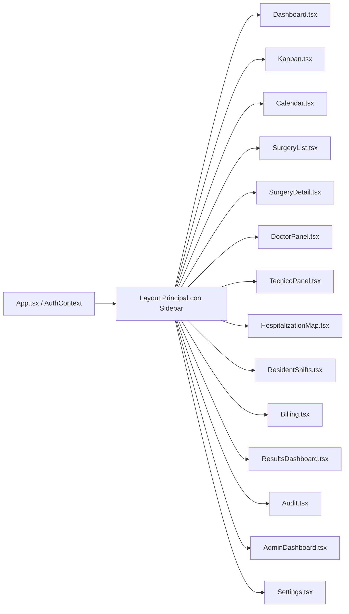

# Árbol de Componentes y Rutas - CodeWiki

> [!NOTE]
> Estructura de navegación y componentes contenedores del **Panel de Cirugías 1.0**.

---

## 🗺️ Mapa de Navegación y Rutas

---

## 🧩 Modales y Popups Principales

- **`SurgeryForm` Modal**: Se activa desde `Kanban`, `Dashboard`, `Calendar` o `SurgeryList` para crear/editar una cirugía.
  - Sub-modal [`CIE10SelectorModal.tsx`](file:///components/CIE10SelectorModal.tsx)
  - Sub-modal [`NomencladorSelectorModal.tsx`](file:///components/NomencladorSelectorModal.tsx)
  - Previsualizador / Impresión de Ficha PDF [`SurgeryPDF.tsx`](file:///components/SurgeryPDF.tsx)
- **Impresión de Pulsera**: [`PatientPrintLabel.tsx`](file:///components/PatientPrintLabel.tsx) invocado desde `SurgeryDetail`, `HospitalizationMap` o `SurgeryForm`.
- **Selector de Camas**: [`HospitalizationMap.tsx`](file:///pages/HospitalizationMap.tsx) abre diálogo de asignación pre-quirúrgica o pase a sala común/UTI.
