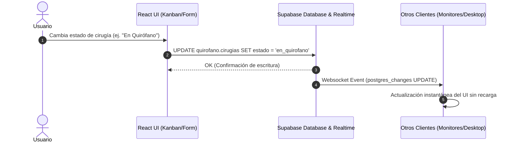
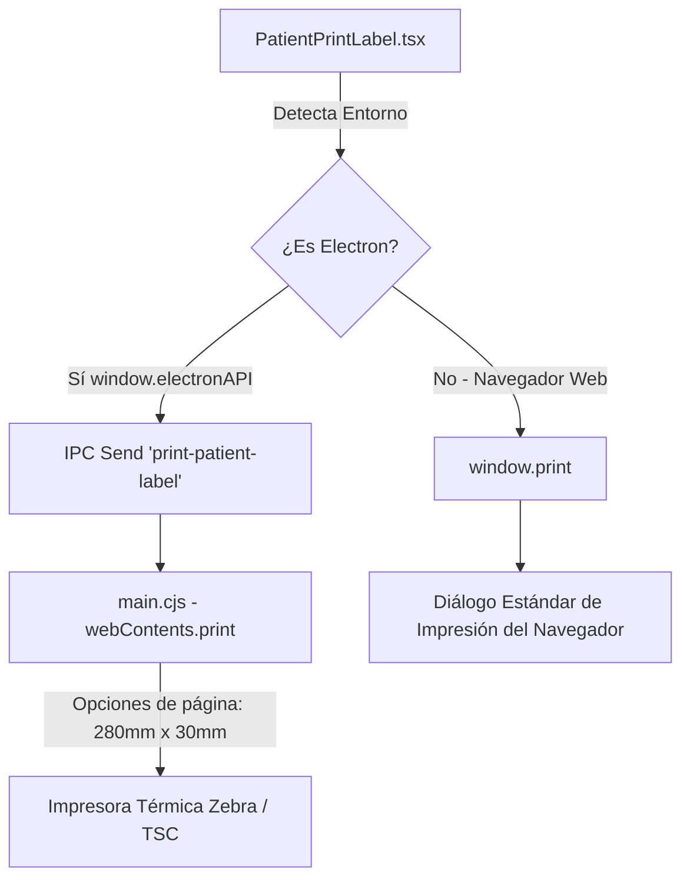

# Flujo de Datos e Sincronización - CodeWiki

> [!NOTE]
> Documentación del modelo de sincronización en tiempo real, integración OSER/SAI e impresión térmica.

---

## 🔄 Flujo de Sincronización Supabase Realtime

---

## 🖨️ Arquitectura e Impresión de Pulseras Térmicas

La impresión de pulseras de pacientes se ejecuta mediante dos rutas dependiendo del entorno de ejecución:

> [!WARNING]
> **Regla de Impresión Térmica**: En Electron (`main.cjs`), NUNCA debe agregarse `landscape: true` a las opciones de `webContents.print()` cuando el CSS especifica `@page { size: 280mm 30mm; margin: 0 !important; }`, ya que causa rotación secundaria no deseada y recorte de datos del paciente en el borde superior de la pulsera.

---

## 🔄 Integración OSER / SAI Scraper

El módulo [`sai-scraper/`](file:///sai-scraper/) interactúa con el sistema hospitalario legado OSER/SAI:

1. **Cola de Trabajo (`OserSyncContext.tsx`)**: Gestiona cirugías pendientes de sincronizar o cotejar con OSER.
2. **Ejecución Playwright**: Extrae datos de partes quirúrgicos programados en SAI.
3. **Normalización e Inserción**: Convierte códigos de práctica y diagnósticos al formato normalizado de Supabase (`quirofano.cirugias`).
